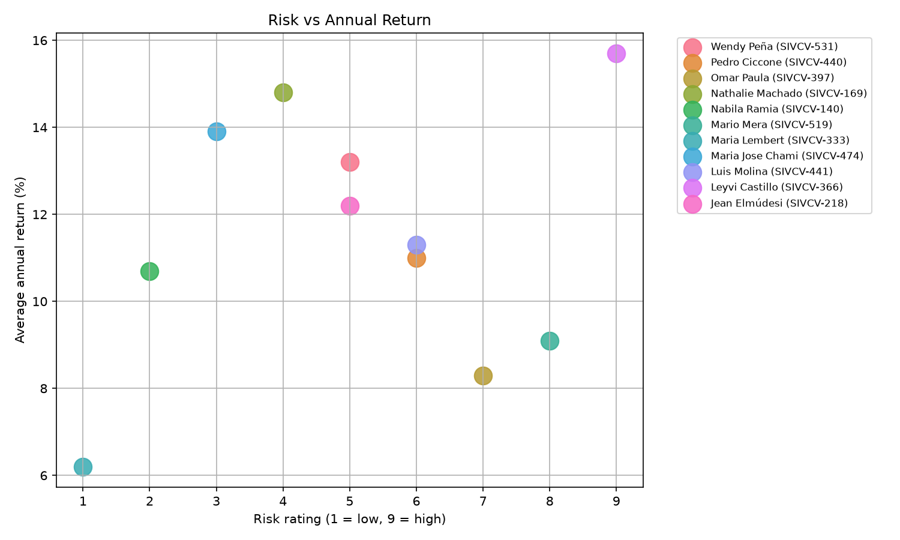
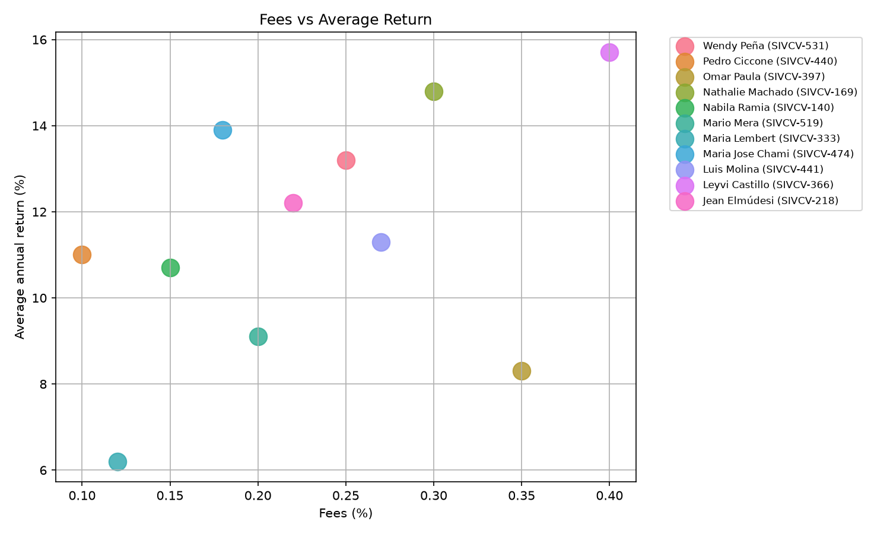
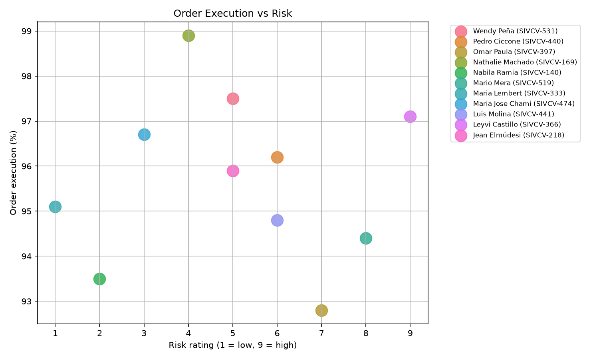
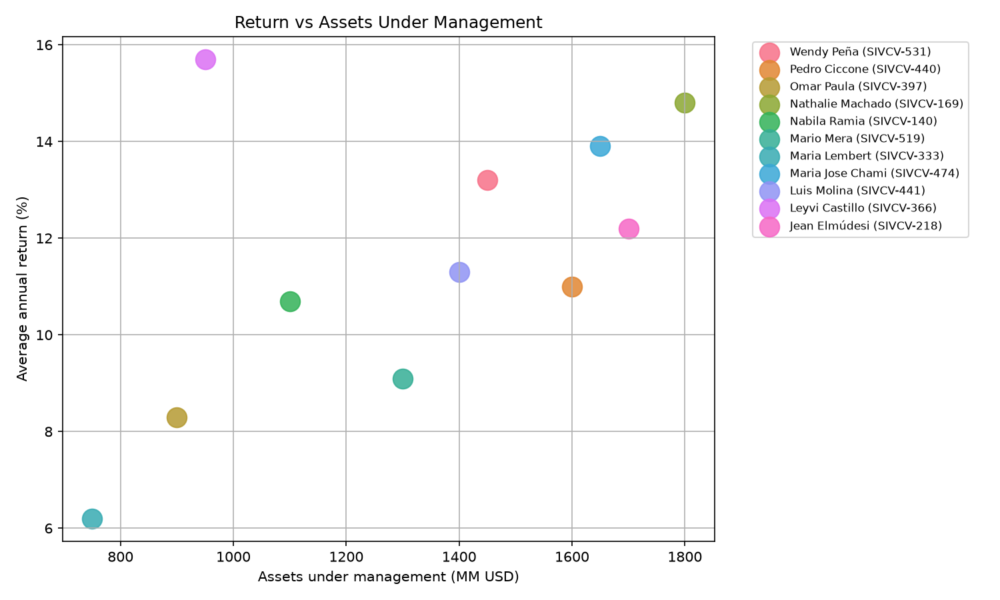
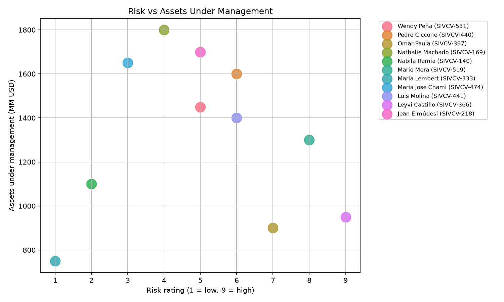

# Comparative KPI Analysis of Stock Brokers

Comparative dashboard of 11 brokers in the Dominican securities market: average annual return, risk rating (1-9), fees, assets under management (AUM) and order execution rate, compared through scatter matrices (risk/return, fees/return, execution/risk, AUM/return).

**About the data:** simulated. Broker names and SIVCV codes come from public information, but every figure is fictional. The value here is the comparative KPI framework applied to the real structure of the market. **Read the full disclaimer below before drawing any conclusion from this project.**

**Why this project:** I follow the Dominican securities market closely (my goal is a Master's in Economics). I built this as a personal portfolio piece to demonstrate my KPI-analysis skills when introducing myself, CV in hand, to representatives of the brokerage firm Parval at the PUCMM job fair in Santiago. In other words: a job-seeking demo, nothing more.

## ⚠️ Disclaimer / Descargo de responsabilidad

**English:**

- **Every numerical figure in this project is FICTIONAL.** Returns, risk ratings, fees, assets under management and execution rates were invented by me for demonstration purposes. They are NOT real financial data, they were NOT measured, estimated or leaked from any source, and they do NOT reflect the actual performance, conduct, quality or ranking of any real person or firm. Any resemblance to real figures is pure coincidence.
- **Names and SIVCV license codes** were taken exclusively from the **public registry of securities brokers** published by the Superintendencia del Mercado de Valores de la República Dominicana (SIMV), which is freely accessible public information. No private, confidential or privileged data of any kind was used or accessed.
- This project has **no affiliation with, endorsement by, or connection to** Parval, the SIMV, the BVRD, or any broker or institution named here.
- This is **not investment advice** and must not be used to compare, evaluate or choose real brokers or firms.
- **Purpose and context:** built in 2026 as a personal exercise to showcase data-analysis skills during a job search (presented alongside my CV at a university job fair). Educational and demonstrative use only.
- **Good faith clause:** if any person named here wishes to have their name removed or anonymized, contact me (Maire505@hotmail.com) and I will do so immediately.

**Español:**

- **Todas las cifras de este proyecto son FICTICIAS.** Retornos, clasificaciones de riesgo, comisiones, activos bajo gestión y tasas de ejecución fueron inventados por mí con fines demostrativos. NO son datos financieros reales, NO fueron medidos, estimados ni filtrados de ninguna fuente, y NO reflejan el desempeño, conducta, calidad ni ranking real de ninguna persona o entidad. Cualquier parecido con cifras reales es pura coincidencia.
- **Los nombres y códigos de licencia SIVCV** provienen exclusivamente del **registro público de corredores de valores** publicado por la Superintendencia del Mercado de Valores de la República Dominicana (SIMV), información pública de libre acceso. No se usó ni se accedió a ningún dato privado, confidencial o privilegiado.
- Este proyecto **no tiene afiliación, respaldo ni conexión** con Parval, la SIMV, la BVRD, ni con ningún corredor o institución aquí mencionada.
- Esto **no es asesoría de inversión** y no debe usarse para comparar, evaluar o elegir corredores o entidades reales.
- **Propósito y contexto:** creado en 2026 como ejercicio personal para demostrar habilidades de análisis de datos durante una búsqueda de empleo (presentado junto a mi CV en una feria de empleo universitaria). Uso exclusivamente educativo y demostrativo.
- **Cláusula de buena fe:** si alguna persona aquí nombrada desea que su nombre sea retirado o anonimizado, puede contactarme (Maire505@hotmail.com) y lo haré de inmediato.

## Results

**Broker comparison, sorted by average annual return** *(simulated figures)*:

| Broker | Avg. annual return (%) | Risk (1-9) | Fees (%) | AUM (MM USD) | Order execution (%) |
|--------|-----------------------:|-----------:|---------:|-------------:|--------------------:|
| Leyvi Castillo (SIVCV-366) | 15.7 | 9 | 0.40 | 950 | 97.1 |
| Nathalie Machado (SIVCV-169) | 14.8 | 4 | 0.30 | 1,800 | 98.9 |
| Maria Jose Chami (SIVCV-474) | 13.9 | 3 | 0.18 | 1,650 | 96.7 |
| Wendy Peña (SIVCV-531) | 13.2 | 5 | 0.25 | 1,450 | 97.5 |
| Jean Elmúdesi (SIVCV-218) | 12.2 | 5 | 0.22 | 1,700 | 95.9 |
| Luis Molina (SIVCV-441) | 11.3 | 6 | 0.27 | 1,400 | 94.8 |
| Pedro Ciccone (SIVCV-440) | 11.0 | 6 | 0.10 | 1,600 | 96.2 |
| Nabila Ramia (SIVCV-140) | 10.7 | 2 | 0.15 | 1,100 | 93.5 |
| Mario Mera (SIVCV-519) | 9.1 | 8 | 0.20 | 1,300 | 94.4 |
| Omar Paula (SIVCV-397) | 8.3 | 7 | 0.35 | 900 | 92.8 |
| Maria Lembert (SIVCV-333) | 6.2 | 1 | 0.12 | 750 | 95.1 |

The quick read: the top returns sit at opposite risk profiles — Castillo chases return with the highest risk rating (9) and the highest fees, while Machado gets nearly the same return at risk 4 with the best execution rate (98.9%). Volume doesn't buy performance either: the biggest books (AUM) aren't the best returns.

### Risk vs Annual Return


### Fees vs Average Return


### Order Execution vs Risk


### Return vs Assets Under Management


### Risk vs Assets Under Management


## Run it

```bash
pip install pandas matplotlib seaborn
python broker_kpi_analysis.py
```

Charts are saved to `images/` automatically.

**Stack:** Python · Pandas · Matplotlib · Seaborn
