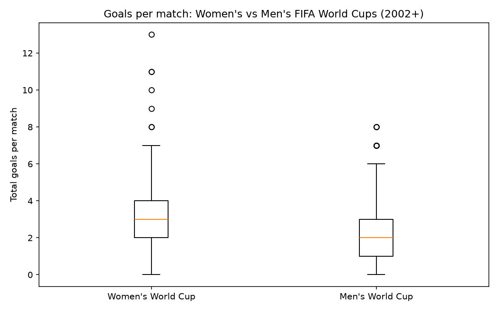

# Hypothesis Test: Goals in Women's vs Men's FIFA World Cups / Test de hipótesis: goles en mundiales femeninos vs masculinos

## 🇬🇧 English version


> **Origin:** this was one of the final projects of my **Data Analyst course at DataCamp**, solved in DataLab. The original notebook is included ([`notebook.ipynb`](./notebook.ipynb)); `fifa_hypothesis_test.py` is the cleaned, runnable version.

### The brief

You're working as a sports journalist at a major online sports media company, specializing in soccer analysis and reporting. You've been watching both men's and women's international soccer matches for a number of years, and your gut instinct tells you that more goals are scored in women's international football matches than men's. This would make an interesting investigative article that your subscribers are bound to love, but you'll need to perform a valid statistical hypothesis test to be sure!

While scoping this project, you acknowledge that the sport has changed a lot over the years, and performances likely vary a lot depending on the tournament, so you decide to limit the data used in the analysis to only official `FIFA World Cup` matches (not including qualifiers) since `2002-01-01`.

You create two datasets containing the results of every official men's and women's international football match since the 19th century, which you scraped from a reliable online source. This data is stored in two CSV files: `women_results.csv` and `men_results.csv`.

The question you are trying to determine the answer to is:

> Are more goals scored in women's international soccer matches than men's?

You assume a **10% significance level**, and use the following null and alternative hypotheses:

- **H₀:** The mean number of goals scored in women's international soccer matches is the same as men's.
- **Hₐ:** The mean number of goals scored in women's international soccer matches is greater than men's.

### Method

1. Filter both datasets to official FIFA World Cup matches since 2002-01-01.
2. Compute total goals per match (home + away).
3. Goal counts are not normally distributed, so the right tool is the **Mann-Whitney U test** (non-parametric), one-sided, via `pingouin.mwu`.
4. Decide against **α = 0.10**.

### Results

```
=== Descriptive statistics (goals per match) ===
Women: n=200, mean=2.98, std=2.02
Men:   n=384, mean=2.51, std=1.65

Reject H0: women's matches score significantly more goals.
{'p_val': 0.0051, 'result': 'reject'}
```

**The verdict: p = 0.0051 < 0.10 → reject H₀.** The gut instinct was right, and now it's backed by statistics: women's FIFA World Cup matches score significantly more goals than men's (about half a goal more per match on average).

**Data coverage (verified against the datasets):** the data ends in 2022 — it spans the men's World Cups **2002-2022** (384 matches, up to the Qatar 2022 final) and the women's World Cups **2003-2019** (200 matches, up to the France 2019 final). The 2023 Women's World Cup and the 2026 World Cup are **not** included; re-running the analysis with the newer tournaments is a natural next step.



### Run it

```bash
pip install pandas matplotlib pingouin
python fifa_hypothesis_test.py
```

The boxplot is saved to `images/` automatically. Datasets (`women_results.csv`, `men_results.csv`) contain public international football results and are included.

**Stack:** Python · Pandas · Pingouin · SciPy · Matplotlib

---

## 🇪🇸 Versión en español


> **Origen:** este fue uno de los proyectos finales de mi **curso de Data Analyst en DataCamp**, resuelto en DataLab. El notebook original está incluido ([`notebook.ipynb`](./notebook.ipynb)); `fifa_hypothesis_test.py` es la versión limpia y ejecutable.

### El planteamiento

Trabajas como periodista deportivo en un gran medio digital, especializado en análisis y reportaje de fútbol. Llevas años viendo partidos internacionales masculinos y femeninos, y tu instinto te dice que en los partidos internacionales femeninos se anotan más goles que en los masculinos. ¡Sería un artículo de investigación interesante que a tus suscriptores les encantará — pero necesitas realizar un test de hipótesis estadístico válido para estar seguro!

Al delimitar el proyecto, reconoces que el deporte ha cambiado mucho con los años y que el rendimiento varía según el torneo, así que decides limitar los datos del análisis solo a partidos oficiales de **Copa del Mundo FIFA** (sin incluir eliminatorias) desde el **01-01-2002**.

Creas dos datasets con los resultados de todos los partidos internacionales oficiales masculinos y femeninos desde el siglo XIX, extraídos de una fuente confiable. Los datos están en dos archivos CSV: `women_results.csv` y `men_results.csv`.

La pregunta que intentas responder es:

> ¿Se anotan más goles en los partidos internacionales femeninos que en los masculinos?

Asumes un **nivel de significancia del 10%**, con las siguientes hipótesis nula y alternativa:

- **H₀:** la media de goles anotados en partidos internacionales femeninos es igual a la de los masculinos.
- **Hₐ:** la media de goles anotados en partidos internacionales femeninos es mayor que la de los masculinos.

### Método

1. Filtrar ambos datasets a partidos oficiales de Copa del Mundo FIFA desde el 01-01-2002.
2. Calcular los goles totales por partido (local + visitante).
3. Los conteos de goles no siguen una distribución normal, así que la herramienta correcta es el **test de Mann-Whitney U** (no paramétrico), de una cola, con `pingouin.mwu`.
4. Decidir contra **α = 0.10**.

### Resultados

```
=== Estadísticas descriptivas (goles por partido) ===
Mujeres: n=200, media=2.98, desv=2.02
Hombres: n=384, media=2.51, desv=1.65

Se rechaza H0: los partidos femeninos anotan significativamente más goles.
{'p_val': 0.0051, 'result': 'reject'}
```

**El veredicto: p = 0.0051 < 0.10 → se rechaza H₀.** El instinto era correcto, y ahora tiene respaldo estadístico: en las Copas del Mundo femeninas se anotan significativamente más goles que en las masculinas (aproximadamente medio gol más por partido en promedio).

**Cobertura de los datos (verificada contra los datasets):** los datos llegan hasta 2022 — abarcan los mundiales masculinos **2002-2022** (384 partidos, hasta la final de Qatar 2022) y los femeninos **2003-2019** (200 partidos, hasta la final de Francia 2019). El Mundial femenino 2023 y el Mundial 2026 **no** están incluidos; re-ejecutar el análisis con los torneos nuevos es el siguiente paso natural.


### Cómo ejecutarlo

```bash
pip install pandas matplotlib pingouin
python fifa_hypothesis_test.py
```

El boxplot se guarda en `images/` automáticamente. Los datasets (`women_results.csv`, `men_results.csv`) contienen resultados públicos de fútbol internacional y están incluidos.

**Stack:** Python · Pandas · Pingouin · SciPy · Matplotlib
