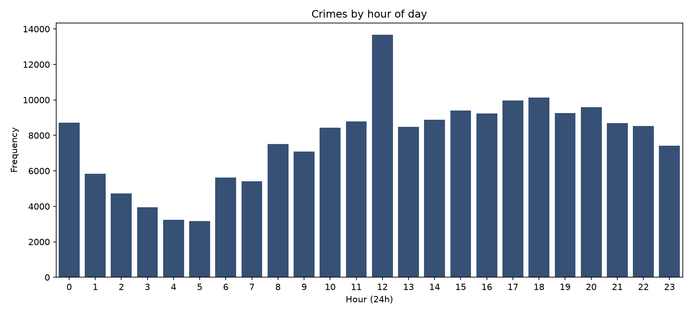
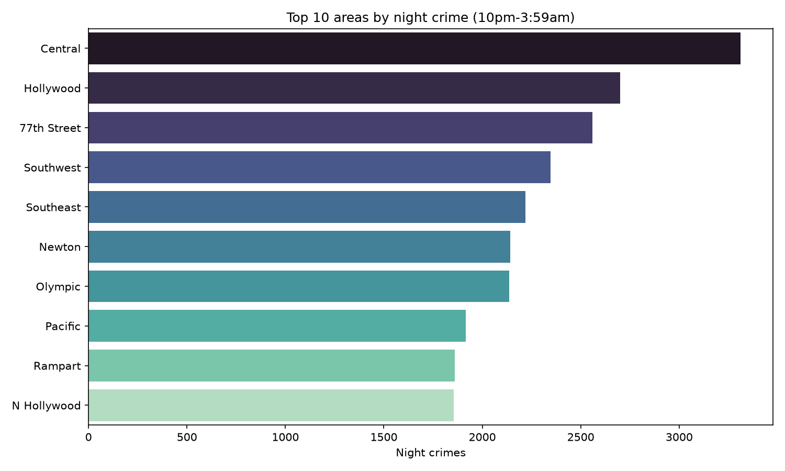
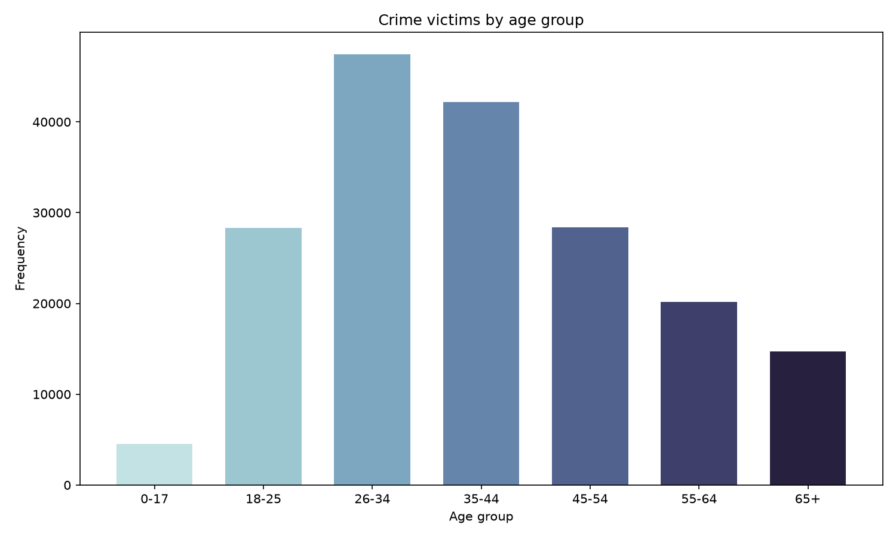
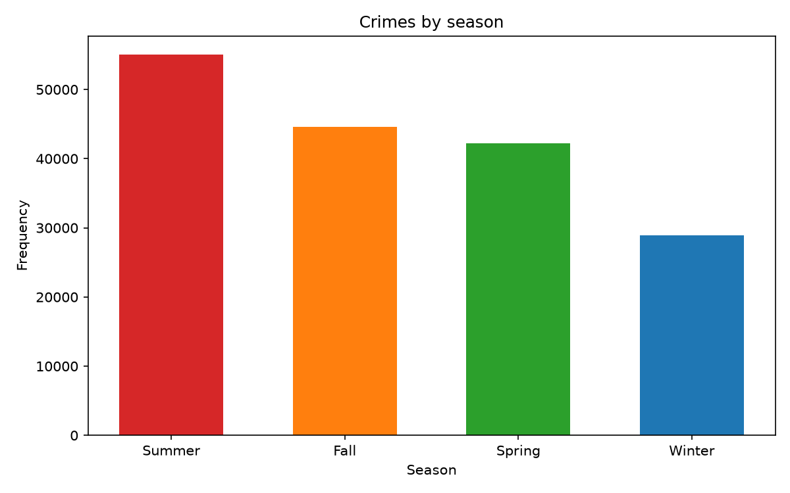
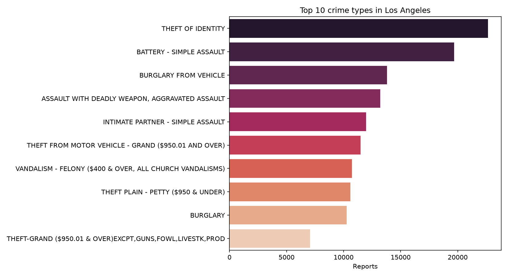
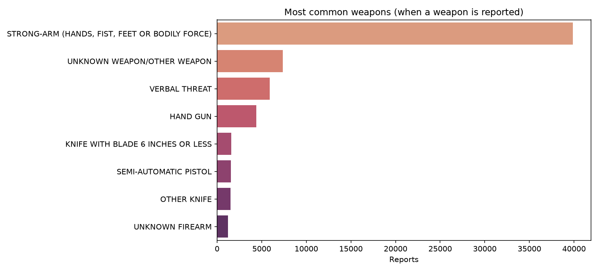
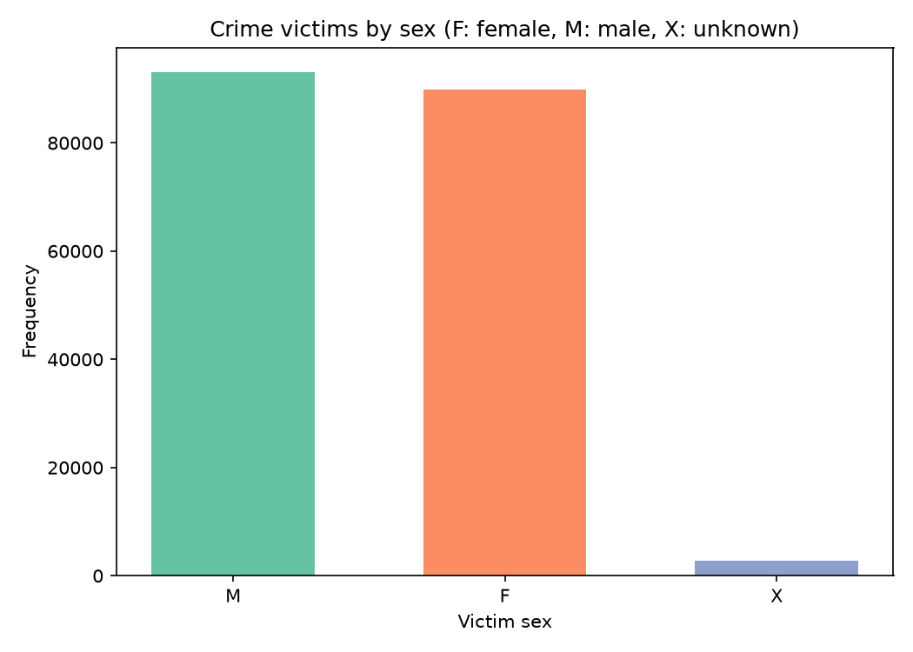

# Crime Patterns in Los Angeles / Patrones de criminalidad en Los Ángeles

## 🇬🇧 English version


> **Origin:** one of the projects of my **Data Analyst course at DataCamp**, solved in DataLab and later expanded. The original notebook is included ([`notebook.ipynb`](./notebook.ipynb)); `la_crime_patterns.py` is the cleaned and extended version.

### The brief

Los Angeles, California 😎. The City of Angels. Tinseltown. The Entertainment Capital of the World! Known for its warm weather, palm trees, sprawling coastline, and Hollywood — but as with any highly populated city, there can be a large volume of crime.

You have been asked to support the Los Angeles Police Department (LAPD) by analyzing crime data to identify patterns in criminal behavior, so they can allocate resources effectively across areas. The dataset is a modified version of the data publicly available from Los Angeles Open Data.

| Column | Description |
|--------|-------------|
| `DR_NO` | Division of Records Number: official file number |
| `Date Rptd` | Date reported (MM/DD/YYYY) |
| `DATE OCC` | Date of occurrence (MM/DD/YYYY) |
| `TIME OCC` | Time in 24-hour military time |
| `AREA NAME` | The 21 geographic areas / patrol divisions, named after a landmark or community |
| `Crm Cd Desc` | Crime committed |
| `Vict Age` | Victim's age in years |
| `Vict Sex` | Victim's sex (F, M, X: unknown) |
| `Vict Descent` | Victim's descent code (A: Other Asian, B: Black, H: Hispanic/Latin/Mexican, W: White, X: Unknown, etc.) |
| `Weapon Desc` | Weapon used (if applicable) |
| `Status Desc` | Crime status |
| `LOCATION` | Street address of the crime |

### Results

**The dataset:** 185,715 crime reports, occurred between 2020-01-01 and 2023-07-03.

- **Peak crime hour: 12:00 noon** — not midnight. Daytime activity (and daytime reporting) beats the night-crime intuition.
- **Night crime (10pm-3:59am) concentrates in Central** — the top night hotspot among the 21 patrol divisions.
- **Victims by age: 26-34 is the most victimized group** (47,470), followed by 35-44 (42,157). Minors (0-17) are the least represented group in reports.
- **Summer is the top crime season** (55,007) and winter the calmest (28,879).
- **The #1 crime in LA is THEFT OF IDENTITY** (22,670 reports) — ahead of simple assault (19,694) and burglary from vehicle (13,799). The city's most common crime is digital, not physical.
- **When a weapon is reported, it's usually no weapon at all:** strong-arm (hands, fists, feet) dominates with 39,889 cases, far above handguns (4,395).
- **Victims by sex are nearly even:** 93,008 male vs 89,854 female. *(Data-quality find: 30 records carry an invalid code "H" — the data dictionary only defines F, M and X — so they were excluded from the chart.)*

#### Crimes by hour of day


#### Top 10 areas by night crime (10pm-3:59am)


#### Crime victims by age group


#### Crimes by season


#### Top 10 crime types


#### Most common weapons (when reported)


#### Crime victims by sex


### Run it

```bash
pip install pandas matplotlib seaborn
python la_crime_patterns.py
```

All charts are saved to `images/` automatically. The dataset (`crimes.csv`, ~27 MB) is included — it is a modified version of publicly available Los Angeles Open Data.

**Stack:** Python · Pandas · NumPy · Seaborn · Matplotlib

---

## 🇪🇸 Versión en español


> **Origen:** uno de los proyectos de mi **curso de Data Analyst en DataCamp**, resuelto en DataLab y luego expandido. El notebook original está incluido ([`notebook.ipynb`](./notebook.ipynb)); `la_crime_patterns.py` es la versión limpia y extendida.

### El planteamiento

Los Ángeles, California 😎. La Ciudad de los Ángeles. Tinseltown. ¡La capital mundial del entretenimiento! Famosa por su clima cálido, sus palmeras, su costa extensa y Hollywood — pero como toda ciudad muy poblada, puede tener un gran volumen de crimen.

Te han pedido apoyar al Departamento de Policía de Los Ángeles (LAPD) analizando datos de criminalidad para identificar patrones de comportamiento criminal, de modo que puedan asignar recursos eficazmente entre las áreas. El dataset es una versión modificada de los datos públicos de Los Angeles Open Data.

| Columna | Descripción |
|---------|-------------|
| `DR_NO` | Número de expediente oficial |
| `Date Rptd` | Fecha de reporte (MM/DD/AAAA) |
| `DATE OCC` | Fecha de ocurrencia (MM/DD/AAAA) |
| `TIME OCC` | Hora en formato militar de 24 horas |
| `AREA NAME` | Las 21 áreas geográficas / divisiones de patrullaje, nombradas por un punto de referencia o comunidad |
| `Crm Cd Desc` | Crimen cometido |
| `Vict Age` | Edad de la víctima en años |
| `Vict Sex` | Sexo de la víctima (F, M, X: desconocido) |
| `Vict Descent` | Código de ascendencia de la víctima (A: otro asiático, B: negro, H: hispano/latino/mexicano, W: blanco, X: desconocido, etc.) |
| `Weapon Desc` | Arma utilizada (si aplica) |
| `Status Desc` | Estado del caso |
| `LOCATION` | Dirección del crimen |

### Resultados

**El dataset:** 185,715 reportes de crímenes, ocurridos entre el 01-01-2020 y el 03-07-2023.

- **Hora pico del crimen: las 12:00 del mediodía** — no la medianoche. La actividad (y el reporte) diurno le gana a la intuición del crimen nocturno.
- **El crimen nocturno (10pm-3:59am) se concentra en Central** — el punto caliente #1 entre las 21 divisiones.
- **Víctimas por edad: 26-34 es el grupo más victimizado** (47,470), seguido de 35-44 (42,157). Los menores (0-17) son el grupo menos representado en los reportes.
- **El verano es la temporada con más crímenes** (55,007) y el invierno la más tranquila (28,879).
- **El crimen #1 de LA es el ROBO DE IDENTIDAD** (22,670 reportes) — por encima de la agresión simple (19,694) y el robo a vehículos (13,799). El crimen más común de la ciudad es digital, no físico.
- **Cuando se reporta un arma, usualmente no es un arma:** la fuerza física (manos, puños, pies) domina con 39,889 casos, muy por encima de las pistolas (4,395).
- **Víctimas por sexo casi parejas:** 93,008 hombres vs 89,854 mujeres. *(Hallazgo de calidad de datos: 30 registros traen un código inválido "H" — el diccionario solo define F, M y X — así que fueron excluidos del gráfico.)*

#### Crímenes por hora del día


#### Top 10 áreas por crimen nocturno (10pm-3:59am)


#### Víctimas por grupo de edad


#### Crímenes por temporada


#### Top 10 tipos de crimen


#### Armas más comunes (cuando se reportan)


#### Víctimas por sexo


### Cómo ejecutarlo

```bash
pip install pandas matplotlib seaborn
python la_crime_patterns.py
```

Todos los gráficos se guardan en `images/` automáticamente. El dataset (`crimes.csv`, ~27 MB) está incluido — es una versión modificada de los datos públicos de Los Angeles Open Data.

**Stack:** Python · Pandas · NumPy · Seaborn · Matplotlib
