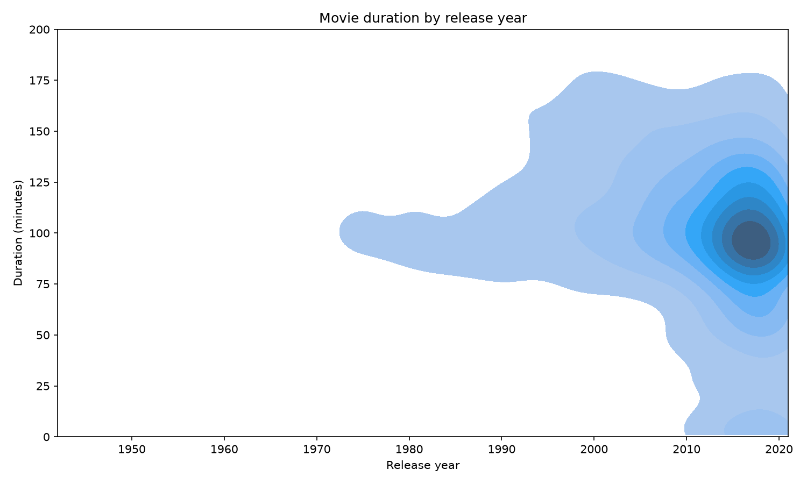
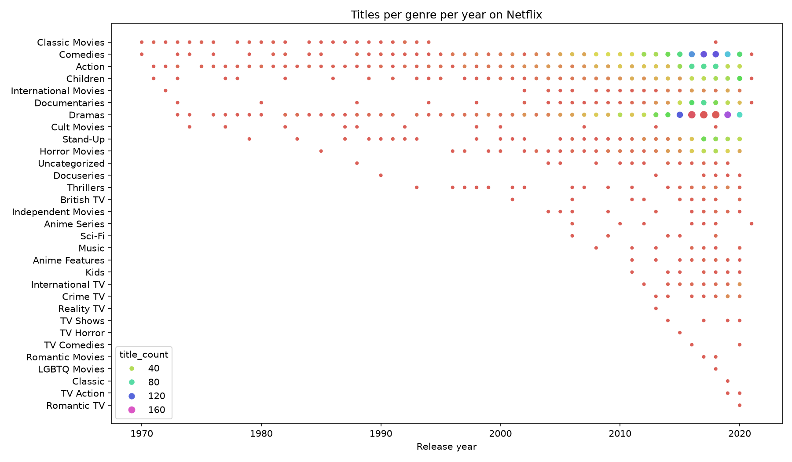
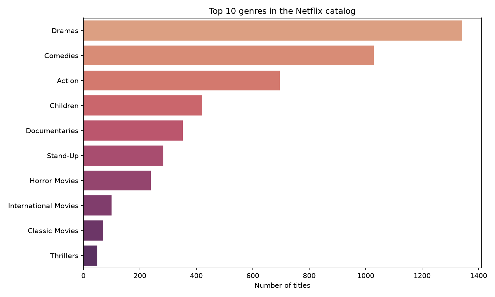
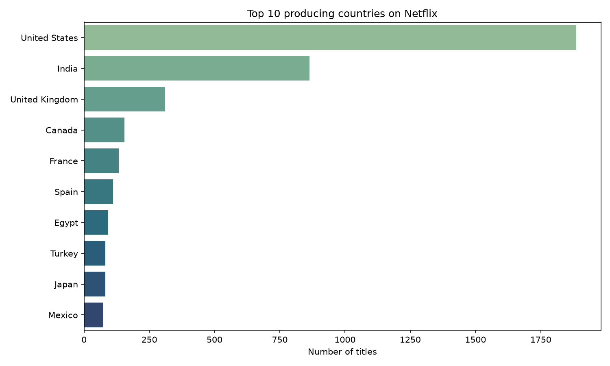
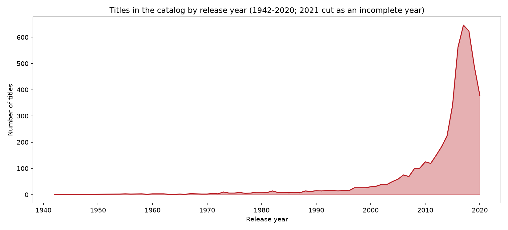
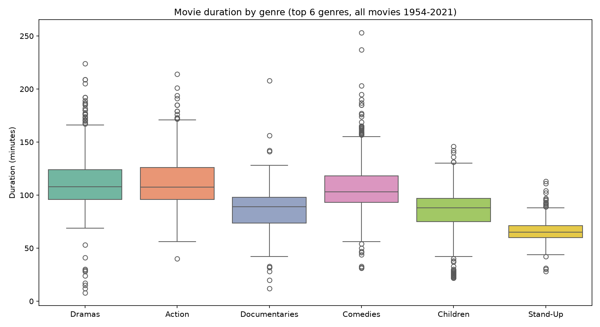
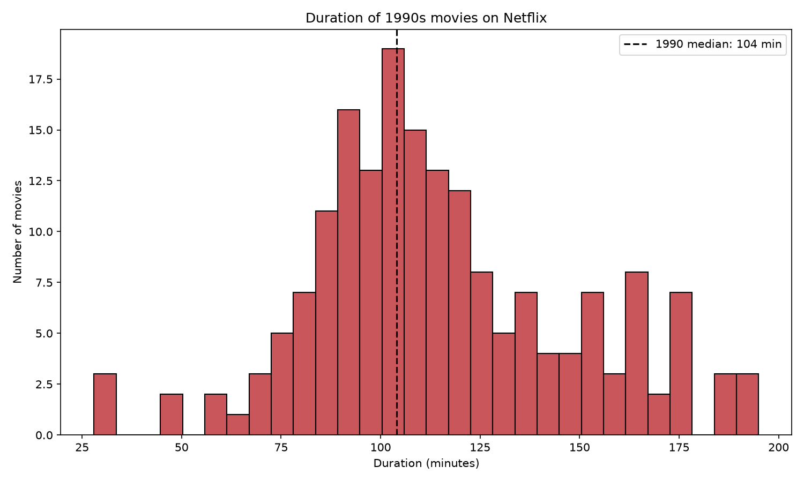
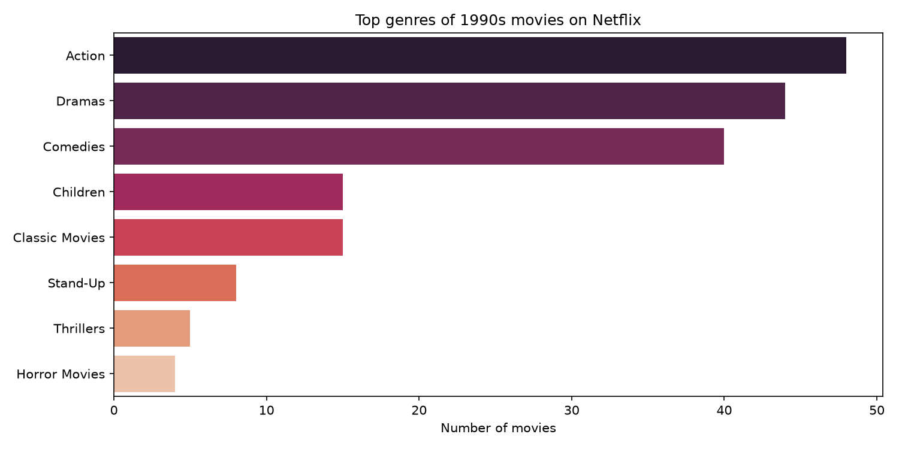

# Netflix Catalog — Exploratory Data Analysis / Catálogo de Netflix — Análisis exploratorio de datos

## 🇬🇧 English version

<center></center>

> **Origin:** one of the projects of my **Data Analyst course at DataCamp**, solved in DataLab and later expanded. The original notebook is included ([`notebook.ipynb`](./notebook.ipynb)); `netflix_eda.py` is the cleaned and extended version.

### The brief

**Netflix**! What started in 1997 as a DVD rental service has since exploded into one of the largest entertainment and media companies.

You work for a production company that specializes in nostalgic styles. You want to do some research on movies released in the 1990's, performing exploratory data analysis on the `netflix_data.csv` dataset to better understand this awesome movie decade!

| Column | Description |
|--------|-------------|
| `show_id` | The ID of the show |
| `type` | Type of show |
| `title` | Title of the show |
| `director` | Director of the show |
| `cast` | Cast of the show |
| `country` | Country of origin |
| `date_added` | Date added to Netflix |
| `release_year` | Year of Netflix release |
| `duration` | Duration of the show in minutes |
| `description` | Description of the show |
| `genre` | Show genre |

### Results

**The catalog:** 4,812 titles (4,677 movies, 135 TV shows), released between 1942 and 2021. Dramas (1,343) and Comedies (1,029) dominate; the US (1,886) and India (864) produce the most.

**The 1990s, as the brief asked:** 183 movies from the decade live in the catalog. The median duration of movies released in 1990 is **104 minutes**, and only **7 action movies of the decade run under 90 minutes**. Action (48) narrowly beats Dramas (44) and Comedies (40) as the decade's top genre — the nineties really were the action decade.

#### Movie duration by release year


#### Titles per genre per year


#### Top 10 genres in the catalog


#### Top 10 producing countries


#### Titles by release year: how the catalog grew (1942-2020; 2021 cut as incomplete)


#### Movie duration by genre (top 6 genres, all movies 1942-2021)


#### The 1990s: duration distribution


#### The 1990s: top genres


### Run it

```bash
pip install pandas matplotlib seaborn
python netflix_eda.py
```

All charts are saved to `images/` automatically. The dataset (`netflix_data.csv`) is included.

**Stack:** Python · Pandas · NumPy · Seaborn · Matplotlib

---

## 🇪🇸 Versión en español

<center></center>

> **Origen:** uno de los proyectos de mi **curso de Data Analyst en DataCamp**, resuelto en DataLab y luego expandido. El notebook original está incluido ([`notebook.ipynb`](./notebook.ipynb)); `netflix_eda.py` es la versión limpia y extendida.

### El planteamiento

¡**Netflix**! Lo que empezó en 1997 como un servicio de alquiler de DVDs explotó hasta convertirse en una de las empresas de entretenimiento y medios más grandes del mundo.

Trabajas para una productora especializada en estilos nostálgicos. Quieres investigar las películas lanzadas en los años 90, realizando un análisis exploratorio de datos sobre el dataset `netflix_data.csv` ¡para entender mejor esa gran década del cine!

| Columna | Descripción |
|---------|-------------|
| `show_id` | ID del título |
| `type` | Tipo de título (película/serie) |
| `title` | Nombre del título |
| `director` | Director |
| `cast` | Elenco |
| `country` | País de origen |
| `date_added` | Fecha en que se añadió a Netflix |
| `release_year` | Año de lanzamiento |
| `duration` | Duración en minutos |
| `description` | Descripción |
| `genre` | Género |

### Resultados

**El catálogo:** 4,812 títulos (4,677 películas, 135 series), lanzados entre 1942 y 2021. Dominan los Dramas (1,343) y las Comedias (1,029); Estados Unidos (1,886) e India (864) son los mayores productores.

**Los años 90, como pedía el brief:** hay 183 películas de esa década en el catálogo. La duración mediana de las películas lanzadas en 1990 es de **104 minutos**, y solo **7 películas de acción de la década duran menos de 90 minutos**. Acción (48) le gana por poco a Dramas (44) y Comedias (40) como género top de la década — los noventa realmente fueron la década de la acción.

#### Duración de películas por año de lanzamiento


#### Títulos por género por año


#### Top 10 géneros del catálogo


#### Top 10 países productores


#### Títulos por año de lanzamiento: cómo creció el catálogo (1942-2020; 2021 cortado por incompleto)


#### Duración de películas por género (top 6 géneros, todas las películas 1942-2021)


#### Los años 90: distribución de duraciones


#### Los años 90: géneros top


### Cómo ejecutarlo

```bash
pip install pandas matplotlib seaborn
python netflix_eda.py
```

Todos los gráficos se guardan en `images/` automáticamente. El dataset (`netflix_data.csv`) está incluido.

**Stack:** Python · Pandas · NumPy · Seaborn · Matplotlib
