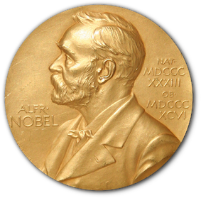
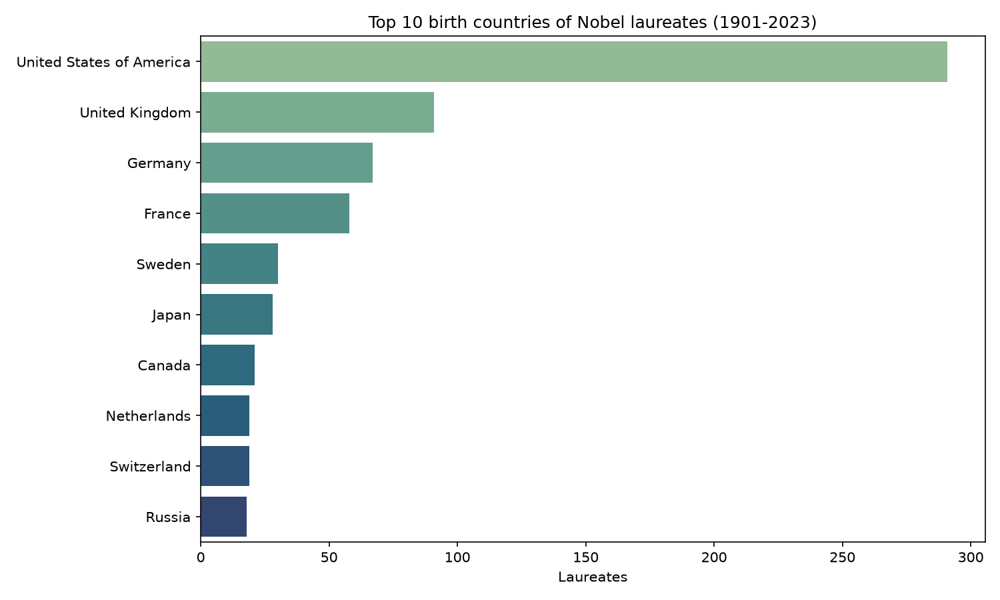
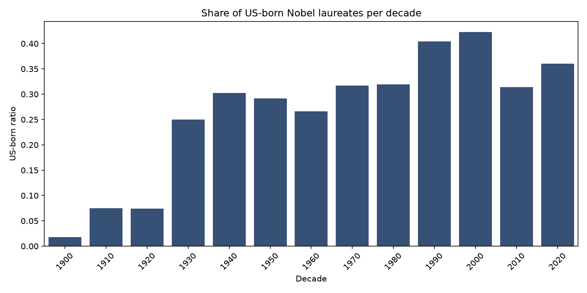
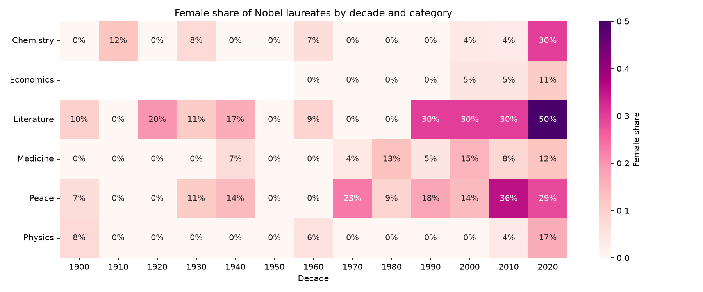
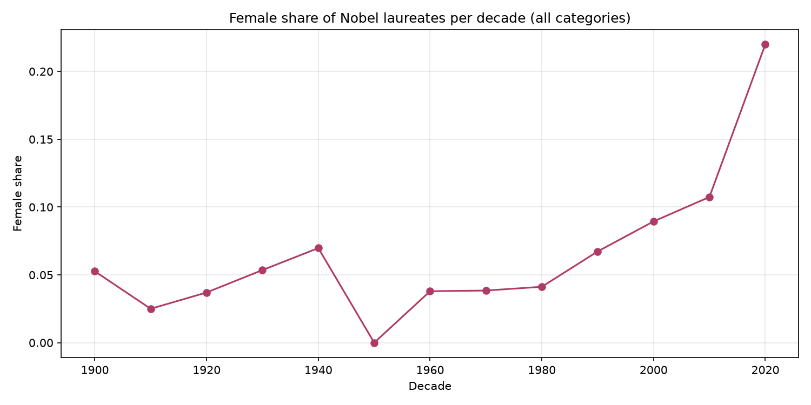

# Visualizing the History of Nobel Prize Winners / Visualizando la historia de los ganadores del Premio Nobel

## 🇬🇧 English version



> **Origin:** one of the projects of my **Data Analyst course at DataCamp**, solved in DataLab and later expanded — including finishing the decade/category female-proportion analysis that my original notebook left incomplete. The original notebook is included ([`notebook.ipynb`](./notebook.ipynb)); `nobel_analysis.py` is the cleaned and extended version.

### The brief

The Nobel Prize has been among the most prestigious international awards since 1901. Each year, awards are bestowed in chemistry, literature, physics, physiology or medicine, economics, and peace. In addition to the honor, prestige, and substantial prize money, the recipient also gets a gold medal with an image of Alfred Nobel (1833-1896), who established the prize.

The Nobel Foundation has made a dataset available of all prize winners from 1901 to 2023 (`nobel.csv`, from the Nobel Prize API). The task: explore and answer several questions about this prizewinning data.

### Results

**The dataset:** 1,000 prizes awarded between 1901 and 2023.

1. **Most awarded gender and birth country:** Male, and the **United States of America**.
2. **Decade with the highest ratio of US-born winners: the 2000s**, when **42.3%** of all laureates were US-born. *(My original code counted absolute wins; the correct answer to the brief needs the ratio — fixed here.)*
3. **Decade + category with the highest proportion of female laureates: Literature in the 2020s (50%)** — the analysis my original notebook left unfinished, now complete, with a heatmap of the female share across every decade and category.
4. **First female laureate: Marie Curie, née Sklodowska (Physics, 1903).**
5. **Repeat winners (6):** Marie Curie, the International Committee of the Red Cross, Linus Carl Pauling, the UNHCR, John Bardeen and Frederick Sanger.

#### Top 10 birth countries of laureates


#### Share of US-born laureates per decade


#### Female share by decade and category (heatmap)


#### Female share per decade (trend)


### Run it

```bash
pip install pandas numpy matplotlib seaborn
python nobel_analysis.py
```

All charts are saved to `images/` automatically. The dataset (`nobel.csv`) is included.

**Stack:** Python · Pandas · NumPy · Seaborn · Matplotlib

---

## 🇪🇸 Versión en español


> **Origen:** uno de los proyectos de mi **curso de Data Analyst en DataCamp**, resuelto en DataLab y luego expandido — incluyendo terminar el análisis de proporción femenina por década/categoría que mi notebook original dejó incompleto. El notebook original está incluido ([`notebook.ipynb`](./notebook.ipynb)); `nobel_analysis.py` es la versión limpia y extendida.

### El planteamiento

El Premio Nobel ha sido uno de los galardones internacionales más prestigiosos desde 1901. Cada año se otorga en química, literatura, física, fisiología o medicina, economía y paz. Además del honor, el prestigio y el importante premio en dinero, el galardonado recibe una medalla de oro con la imagen de Alfred Nobel (1833-1896), quien estableció el premio.

La Fundación Nobel publicó un dataset con todos los ganadores desde 1901 hasta 2023 (`nobel.csv`, del API del Premio Nobel). La tarea: explorar y responder varias preguntas sobre estos datos premiados.

### Resultados

**El dataset:** 1,000 premios otorgados entre 1901 y 2023.

1. **Género y país de nacimiento más premiados:** masculino, y **Estados Unidos**.
2. **Década con mayor proporción de ganadores nacidos en EE.UU.: los 2000s**, cuando el **42.3%** de todos los laureados nacieron allí. *(Mi código original contaba victorias absolutas; la respuesta correcta del brief requiere la proporción — corregido aquí.)*
3. **Década + categoría con mayor proporción de laureadas: Literatura en los 2020s (50%)** — el análisis que mi notebook original dejó inconcluso, ahora completo, con un heatmap de la proporción femenina en cada década y categoría.
4. **Primera mujer laureada: Marie Curie, née Sklodowska (Física, 1903).**
5. **Ganadores múltiples (6):** Marie Curie, el Comité Internacional de la Cruz Roja, Linus Carl Pauling, el ACNUR, John Bardeen y Frederick Sanger.

#### Top 10 países de nacimiento de los laureados


#### Proporción de laureados nacidos en EE.UU. por década


#### Proporción femenina por década y categoría (heatmap)


#### Proporción femenina por década (tendencia)


### Cómo ejecutarlo

```bash
pip install pandas numpy matplotlib seaborn
python nobel_analysis.py
```

Todos los gráficos se guardan en `images/` automáticamente. El dataset (`nobel.csv`) está incluido.

**Stack:** Python · Pandas · NumPy · Seaborn · Matplotlib
