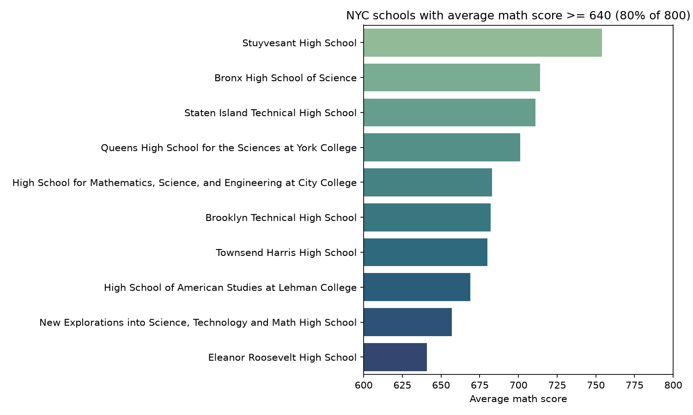
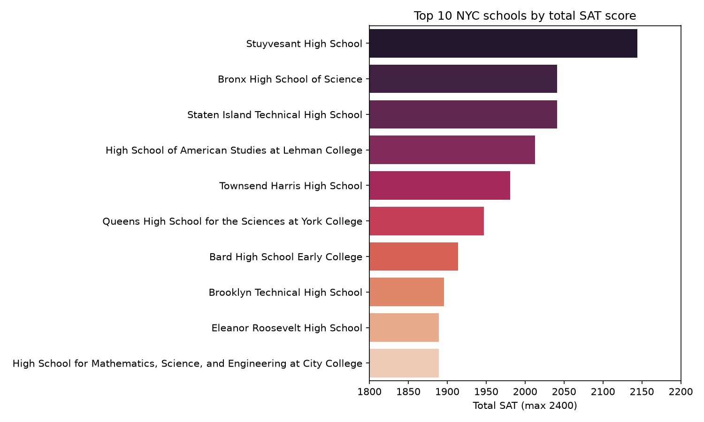
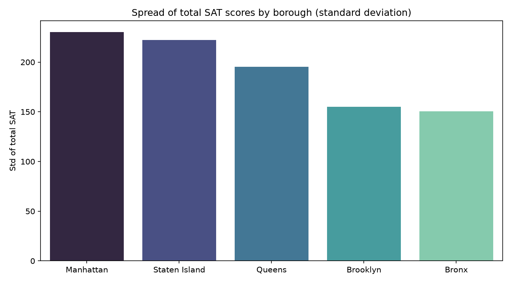
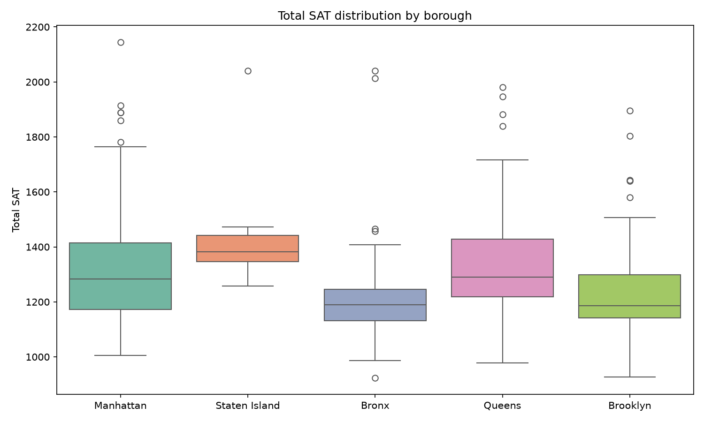
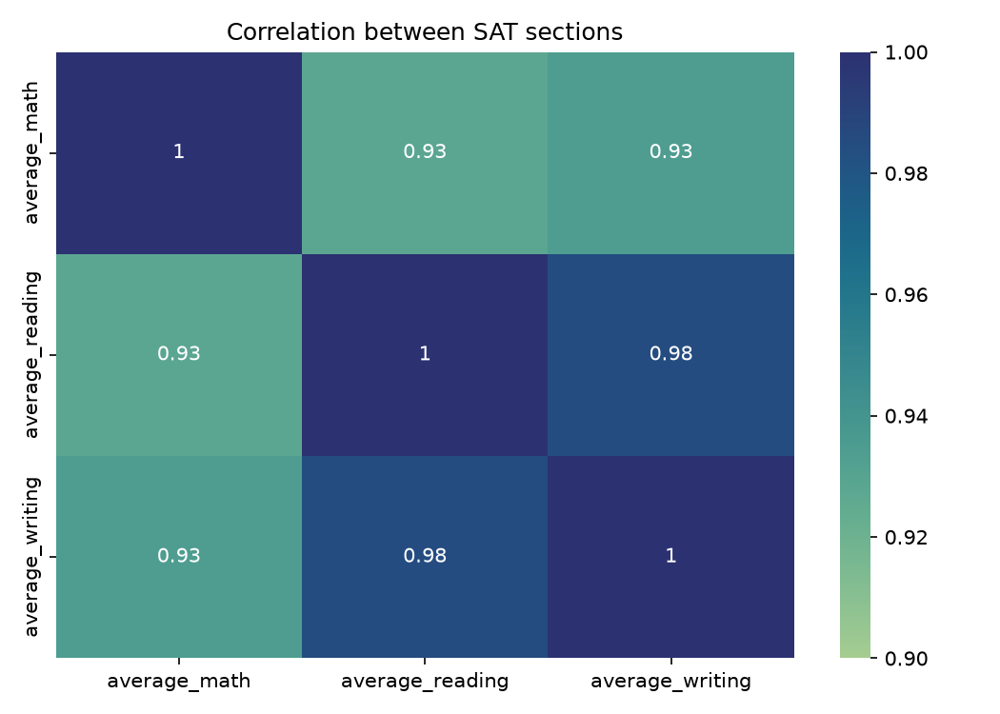

# Exploring NYC Public School Test Result Scores / Explorando los resultados SAT de las escuelas públicas de NYC

## 🇬🇧 English version


*Photo by [Jannis Lucas](https://unsplash.com/@jannis_lucas) on [Unsplash](https://unsplash.com).*

> **Origin:** one of the projects of my **Data Analyst course at DataCamp**, solved in DataLab and later expanded. The original notebook is included ([`notebook.ipynb`](./notebook.ipynb)); `nyc_schools_analysis.py` is the cleaned and extended version.

### The brief

Every year, American high school students take SATs, which are standardized tests intended to measure literacy, numeracy, and writing skills. There are three sections — reading, math, and writing, each with a **maximum score of 800 points**. These tests are extremely important for students and colleges, as they play a pivotal role in the admissions process.

Analyzing the performance of schools is important for a variety of stakeholders, including policy and education professionals, researchers, government, and even parents considering which school their children should attend. You have been tasked with answering three key questions about New York City (NYC) public school SAT performance using `schools.csv`.

### Results

**The dataset:** 375 public schools across the 5 boroughs.

1. **Best math schools (average ≥ 640, i.e. 80% of 800):** only 10 schools make the cut, led by **Stuyvesant High School (754)**, Bronx High School of Science (714) and Staten Island Technical (711).
2. **Top 10 by total SAT:** Stuyvesant again dominates with **2,144 of 2,400** — almost 100 points above the runner-ups (Bronx Science and Staten Island Tech, 2,041 each).
3. **Borough with the largest spread: Manhattan** (std = 230.3 across its 89 schools, average 1,340) — home to both elite schools and struggling ones, the widest inequality of results in the city.
4. *(Expansion)* **The three sections move together:** math/reading/writing correlate at 0.93+, so a school strong in one section is almost always strong in the rest.

#### Schools with average math ≥ 640


#### Top 10 schools by total SAT


#### Spread of total SAT by borough (std)


#### Total SAT distribution by borough


#### Correlation between SAT sections


### Run it

```bash
pip install pandas matplotlib seaborn
python nyc_schools_analysis.py
```

All charts are saved to `images/` automatically. The dataset (`schools.csv`) is included.

**Stack:** Python · Pandas · Seaborn · Matplotlib

---

## 🇪🇸 Versión en español


*Foto de [Jannis Lucas](https://unsplash.com/@jannis_lucas) en [Unsplash](https://unsplash.com).*

> **Origen:** uno de los proyectos de mi **curso de Data Analyst en DataCamp**, resuelto en DataLab y luego expandido. El notebook original está incluido ([`notebook.ipynb`](./notebook.ipynb)); `nyc_schools_analysis.py` es la versión limpia y extendida.

### El planteamiento

Cada año, los estudiantes de secundaria de Estados Unidos toman el SAT, un examen estandarizado que mide comprensión lectora, matemáticas y escritura. Tiene tres secciones — lectura, matemáticas y escritura, cada una con un **máximo de 800 puntos**. Estos exámenes son extremadamente importantes para estudiantes y universidades, pues juegan un papel central en el proceso de admisión.

Analizar el desempeño de las escuelas importa a muchos actores: profesionales de políticas educativas, investigadores, el gobierno, e incluso padres eligiendo escuela para sus hijos. Tu tarea es responder tres preguntas clave sobre el desempeño SAT de las escuelas públicas de Nueva York usando `schools.csv`.

### Resultados

**El dataset:** 375 escuelas públicas en los 5 distritos (boroughs).

1. **Mejores escuelas en matemáticas (promedio ≥ 640, es decir 80% de 800):** solo 10 escuelas lo logran, lideradas por **Stuyvesant High School (754)**, Bronx High School of Science (714) y Staten Island Technical (711).
2. **Top 10 por SAT total:** Stuyvesant domina de nuevo con **2,144 de 2,400** — casi 100 puntos sobre los segundos lugares (Bronx Science y Staten Island Tech, 2,041 cada una).
3. **Distrito con mayor dispersión: Manhattan** (desviación estándar = 230.3 entre sus 89 escuelas, promedio 1,340) — alberga tanto escuelas de élite como escuelas rezagadas: la mayor desigualdad de resultados de la ciudad.
4. *(Expansión)* **Las tres secciones se mueven juntas:** matemáticas/lectura/escritura correlacionan a 0.93+, así que una escuela fuerte en una sección casi siempre es fuerte en las demás.

#### Escuelas con promedio de matemáticas ≥ 640


#### Top 10 escuelas por SAT total


#### Dispersión del SAT total por distrito (desv. est.)


#### Distribución del SAT total por distrito


#### Correlación entre secciones del SAT


### Cómo ejecutarlo

```bash
pip install pandas matplotlib seaborn
python nyc_schools_analysis.py
```

Todos los gráficos se guardan en `images/` automáticamente. El dataset (`schools.csv`) está incluido.

**Stack:** Python · Pandas · Seaborn · Matplotlib
